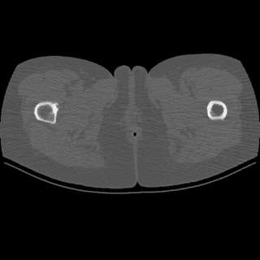
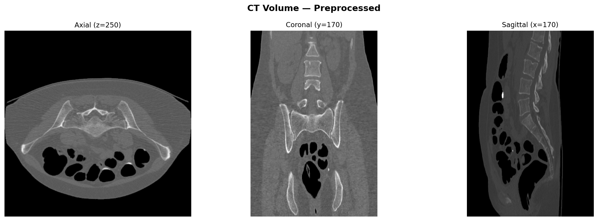
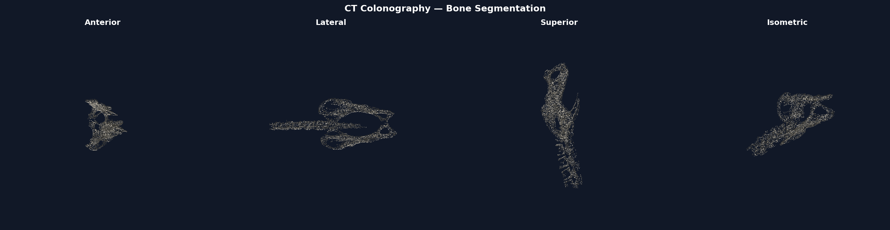

# DICOM to 3D Surgical Model Converter


> **Converts CT/MRI scans into 3D-printable anatomical models for surgical simulation.**

Built by **Ricardo Garza Benítez** — Biomedical Engineering student at Universidad de Monterrey (UDEM), with a focus on medical imaging pipelines for surgical simulation.

---



*CT Colonography scan scrolling through 500 axial slices — the full pipeline processes this volume in under 2 minutes.*

---

## Quick Start

```bash
# 1. Clone and install
git clone https://github.com/yourusername/dicom-to-3d
cd dicom-to-3d
pip install -r requirements.txt

# 2. Download a free CT dataset (no login required)
python download_sample.py

# 3. Run the full pipeline
python main.py --input ./data/sample --structure bone \
               --output ./output/stl/bone.stl --visualize

# Optional: also generate a slice animation GIF
python main.py --input ./data/sample --structure bone \
               --output ./output/stl/bone.stl --visualize --animate
```

**Supported structures:**

| Flag | Structure | HU Threshold |
|------|-----------|-------------|
| `bone` | All bone (default) | > 400 HU |
| `cortical_bone` | Dense outer bone | > 400 HU |
| `trabecular_bone` | Spongy inner bone | > 150 HU |
| `soft_tissue` | Organs / muscle | ~ 40 HU |

---

## Visual Outputs

### Orthogonal Slice Views



*Axial, coronal, and sagittal cross-sections through the resampled CT volume.*

### 3D Bone Mesh — Four Clinical Views



*Bone segmentation from a CT Colonography scan. The mesh captures the spine, pelvis, femoral heads, and ribs visible in the abdominal field of view.*

---

## Pipeline

The five processing stages, each in its own module:

```
[1] Load DICOM     →  sorted 3D numpy array in Hounsfield Units
[2] Preprocess     →  table removal, isotropic resampling to 1 mm³
[3] Segment        →  Gaussian smoothing + Marching Cubes at HU threshold
[4] Clean mesh     →  keep largest component, Laplacian smoothing, hole-filling
[5] Export STL     →  binary STL ready for 3D printing or simulation
```

### Stage details

**1 — DICOM Loader** (`src/loader.py`)
Recursively finds all `.dcm` files, reads them with `pydicom`, sorts by `ImagePositionPatient` Z-coordinate (not filename, which is unreliable), applies the `RescaleSlope` / `RescaleIntercept` tags to convert raw pixel values into calibrated Hounsfield Units.

**2 — Preprocessor** (`src/preprocessor.py`)
Removes the CT scanner table by keeping only the largest connected body region above −500 HU. Resamples the volume to isotropic 1 mm voxels with `scipy.ndimage.zoom` so the output mesh has correct physical dimensions regardless of the scanner's slice thickness.

**3 — Segmentor** (`src/segmentor.py`)
Applies a light Gaussian blur (σ = 1) to suppress voxel-level noise, then runs `skimage.measure.marching_cubes` at a tissue-specific HU isovalue. The `spacing` parameter converts voxel indices to millimetres during surface extraction.

**4 — Mesh Cleaner** (`src/mesh_utils.py`)
Splits the raw mesh into connected components and keeps the largest, discarding floating fragments from scan noise or metal artifacts. Applies Laplacian smoothing to reduce the staircase surface artifact from voxelisation. Calls `fill_holes()` and `fix_normals()` for 3D-printing compatibility.

**5 — STL Export** (`src/mesh_utils.py`)
Exports a binary STL (compact format, readable by Mimics, 3D Slicer, Meshmixer, and all FDM slicers). Prints vertex/face counts and file size.

---

## Clinical Context

### Why physical anatomical models matter in surgery

Surgeons train and plan operations using cadavers, synthetic phantoms, and increasingly — patient-specific 3D-printed models made directly from pre-operative CT or MRI scans. These models allow:

- **Pre-operative rehearsal** of complex reconstructions (acetabular fractures, craniofacial surgery, spinal deformity correction)
- **Intra-operative reference** — a physical model sterilised and placed on the surgical field
- **Patient communication** — explaining a procedure using a replica of the patient's own anatomy
- **Resident education** — trainee surgeons can practice osteotomies and implant fitting on realistic bone models without risk

### Hounsfield Units and tissue selection

CT scanners report radiodensity in Hounsfield Units (HU), a linear scale calibrated so that distilled water = 0 HU and air = −1000 HU. This standardisation means the same threshold works across different scanners and patients:

| Tissue | HU Range | Why it matters |
|--------|----------|----------------|
| Air | −1000 | Background / lung |
| Fat | −100 to −50 | Body composition |
| Water / CSF | 0 | Baseline reference |
| Soft tissue | 20 – 80 | Organs, muscle |
| Cancellous bone | 150 – 400 | Trabecular (spongy) bone |
| Cortical bone | 400 – 1000 | Dense outer shell |
| Metal implants | > 1000 | Causes streak artifacts |

Selecting the right isovalue at the boundary between two tissues is what makes Marching Cubes produce a clean surface rather than a noisy one.

---

## Project Structure

```
dicom-to-3d/
├── src/
│   ├── loader.py         # DICOM loading, sorting, HU conversion
│   ├── preprocessor.py   # Table removal, HU windowing, resampling
│   ├── segmentor.py      # Marching Cubes surface extraction
│   ├── mesh_utils.py     # Mesh cleaning, smoothing, STL export
│   └── visualizer.py     # Slice viewer, GIF animation, 3D renders
├── data/
│   └── sample/           # DICOM files go here (not tracked by git)
├── output/
│   ├── stl/              # Generated STL files
│   └── renders/          # PNG and GIF outputs
├── download_sample.py    # Auto-download CT data from TCIA (no login)
├── main.py               # CLI entry point
└── requirements.txt
```

---

## Dependencies

| Package | Purpose |
|---------|---------|
| `pydicom` | Read DICOM files and metadata |
| `numpy` | Volumetric array operations |
| `scipy` | Isotropic resampling, connected components |
| `scikit-image` | Marching Cubes, Gaussian filter |
| `trimesh` | Mesh processing, smoothing, STL export |
| `matplotlib` | Slice visualisation, 3D mesh renders |
| `tqdm` | Progress bars |
| `SimpleITK` | Advanced image I/O (optional) |

---

## Free DICOM Datasets

| Source | Access | Good for |
|--------|--------|----------|
| [TCIA — The Cancer Imaging Archive](https://www.cancerimagingarchive.net) | Public, no login | CT, MRI, PET |
| [OsiriX DICOM Sample Library](https://www.osirix-viewer.com/resources/dicom-image-library/) | Public | Curated test cases |
| [Embodi3D](https://www.embodi3d.com) | Free account | Bone STLs with source DICOM |

The included `download_sample.py` fetches a CT Colonography series directly from TCIA using the public REST API.

---

## Downloads

The STL file generated from the CT Colonography sample (43 MB, 865 K faces) is too large for the repository. It is available as a release asset:

**[Releases →](../../releases)** — look for `bone_ct_colonography.stl` under the latest release.

To reproduce it locally from scratch:

```bash
python download_sample.py          # ~200 MB download from TCIA
python main.py --input ./data/sample --structure bone \
               --output ./output/stl/bone.stl --visualize --animate
```

---

## About

**Ricardo Garza Benítez**
Biomedical Engineering — Universidad de Monterrey (UDEM)
Research focus: medical imaging, DICOM preprocessing, CNNs for anatomical segmentation, and physical models for surgical simulation.

---

*Part of a broader project on patient-specific anatomical models for surgical education.*
